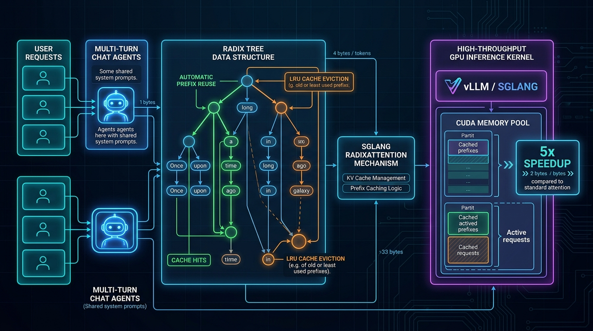

# SGLang RadixAttention & Prefix Caching Studio

[](LICENSE)
[](.github/workflows/sre-validation.yml)
[](https://www.python.org/)
[](https://github.com/sgl-project/sglang)
[](https://talaripradeep.info/tools/sglang-radix-attention/)

High-throughput prefix-caching architecture that maintains a dynamic **Radix Tree** of KV-cache tensors across multi-turn agent chats, hierarchical system prompts, and tree-search decodings. Reuses attention computations across disparate client requests to deliver up to **5.1x throughput improvement** with zero recomputation.

---

## 🏛️ Architecture Flow Diagram



---

## 🎬 3Blue1Brown / Manim Programmatic Video Generator

This repository includes a production-grade **Manim** (`manim_flow.py`) animation script rendering the Radix Tree KV-cache branching dynamics at 60fps.

```bash
# 1. Install animation manifest
pip install -r requirements-animation.txt

# 2. Render fast preview
manim -pql manim_flow.py SGLangRadixAttentionScene

# 3. Render Ultra HD 4K 60fps
manim -pqk manim_flow.py SGLangRadixAttentionScene
```

---

## 🚀 Quickstart & Validation

```bash
git clone https://github.com/Pradeeptalari14/tp-sglang-radix-attention.git
cd tp-sglang-radix-attention

# Install core runtime dependencies
pip install -r requirements.txt

# Run SRE validation suite
bash scripts/validate.sh
```

---

## 📂 Repository Layout

```text
├── .github/workflows/
│   └── sre-validation.yml
├── docs/
│   └── sglang_architecture_flow.png
├── scripts/
│   └── validate.sh
├── radix_engine.py             # SGLang RadixTree caching gateway
├── radix_tree.ts               # Visual prefix tree data structure
├── k8s-sglang.yaml             # Kubernetes GPU deployment manifest
├── docker-compose.yml
├── requirements.txt            # Core HTTP dependencies for clean CI
├── requirements-gpu.txt        # Full SGLang CUDA stack
├── requirements-animation.txt  # Manim 4K animation dependencies
├── manim_flow.py               # 3Blue1Brown/Manim programmatic 4K video animation
├── package.json
├── LICENSE
├── SECURITY.md
└── README.md
```
